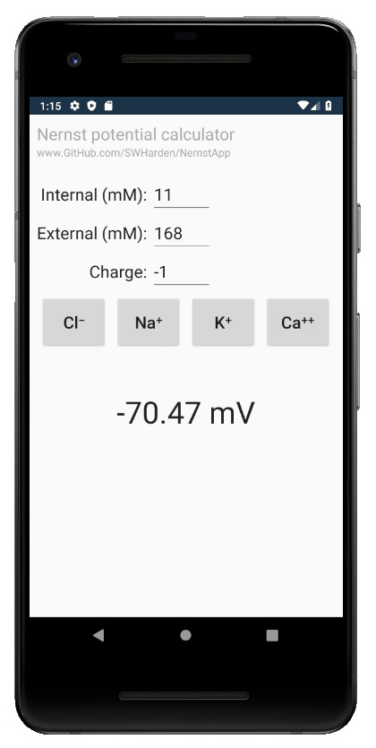
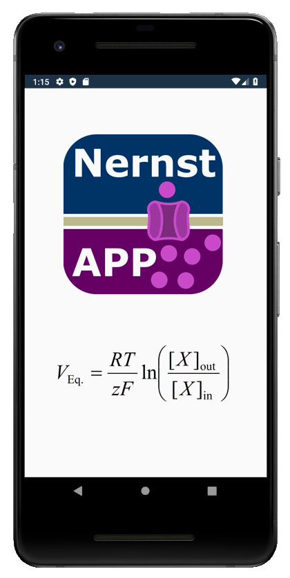

# NernstApp
NernstApp is an Android application which uses the [Nernst equation](https://en.wikipedia.org/wiki/Nernst_equation) to calculate the equilibrium potential (Nernst potential) for an ion based on its charge and concentration on each side of a selectively-permanent membrane. This tool can be used to estimate the reversal potential of an ion across a cell membrane which can be useful in the fields of neuroscience, electrophysiology, and cellular neurophysiology.

