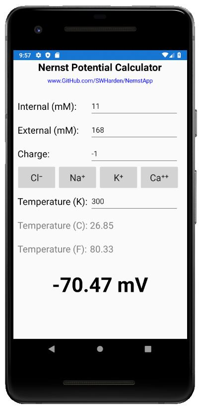
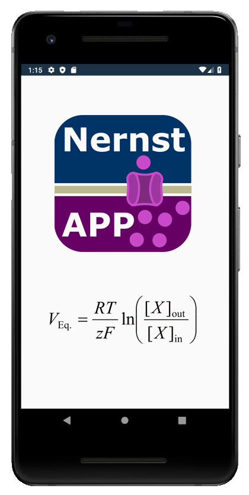

# NernstApp
NernstApp is a mobile app which uses the [Nernst equation](https://en.wikipedia.org/wiki/Nernst_equation) to calculate the equilibrium potential (Nernst potential) for an ion based on its charge and concentration on each side of a selectively-permanent membrane. This tool can be used to estimate the reversal potential of an ion across the cell membrane of a neuron.

## Developer Notes

NernstApp is an open source project created in Visual Studio Community 2019. Aspiring mobile developers may find the source code and project structure useful to review. Code provided here demonstrates how to make the same application in both native Xamarin and Xamarin.Forms. 

**NernstApp 1.5** is a Xamarin.Forms project which supports Android and iPhone. Source code for the GUI ([MainPage.xaml](/src/Xamarin.Forms/NernstApp/MainPage.xaml)) and logic ([MainPage.xaml.cs](/src/Xamarin.Forms/NernstApp/MainPage.xaml.cs)) is easy to review.

**NernstApp 1.4** is a Xamarin native Android project which only supports Android. Source code for the GUI ([content_main.xml](/src/Xamarin.Native.Android/Resources/layout/content_main.xml)) and logic ([MainActivity.cs](/src/Xamarin.Native.Android/MainActivity.cs)) is easy to review.

Information about how to create custom icons for both apps and upload the builds to the Google Play Store see [build notes](dev/buildNotes.md).

